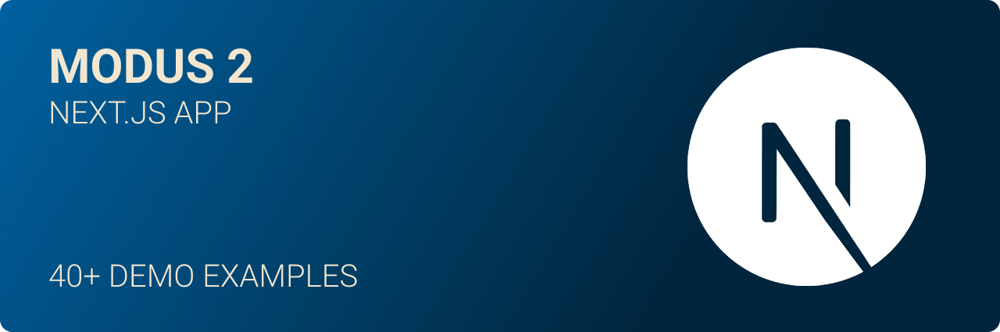
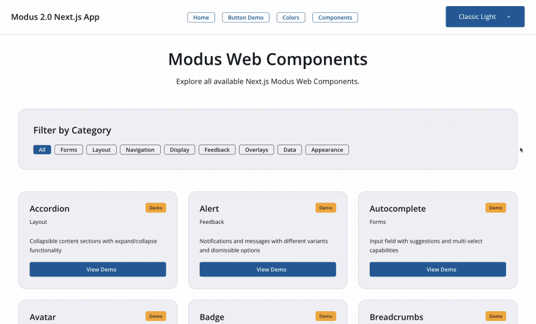

[](https://github.com/julianoczkowski/modus-nextjs-demos/actions/workflows/publish.yml)
[](https://nodejs.org/)
[](https://opensource.org/licenses/MIT)

# Modus Next.js Demos

Demo pages for Modus Web Components Next.js integration. This package automatically provides demo pages for all Modus Web Components in your Next.js application.

## Prerequisites

🔥 You will need the main boilerplate Next.js Modus 2 Web Componenents app which can be found here: https://github.com/julianoczkowski/modus-next-app

## Installation

```bash
npm install @julianoczkowski/modus-nextjs-demos
```

If you get any version errors use:

```bash
npm install @julianoczkowski/modus-nextjs-demos --legacy-peer-deps
```

The demo pages will be automatically copied to your `app/demos/` directory during installation.

## What's Included

This package includes demo pages for:

- **Forms**: Button, Checkbox, Date, Number Input, Radio, Select, Switch, Text Input, Textarea, Time Input
- **Layout**: Accordion, Card, Divider, Toolbar, Utility Panel
- **Navigation**: Breadcrumbs, Dropdown Menu, Menu, Navbar, Pagination, Side Navigation, Stepper, Tabs
- **Display**: Avatar, Badge, Chip, Icon, Skeleton
- **Feedback**: Alert, Input Feedback, Input Label, Loader, Progress, Toast, Tooltip
- **Overlays**: Modal
- **Data**: Table
- **Appearance**: Theme Switcher



## Usage

After installation, the demo pages are available at:

- `/demos/components-demo` - Overview of all available components
- `/demos/button-demo` - Button component demos
- `/demos/modal-demo` - Modal component demos
- `/demos/table-demo` - Table component demos
- And many more...

## Component Imports

The demo pages use the standard Next.js path aliases:

```tsx
import ModusButton from "@/app/components/ModusButton";
import DemoPage from "@/app/components/DemoPage";
import DemoExample from "@/app/components/DemoExample";
```

## Requirements

- Next.js 15+
- React 19+
- Modus Web Components React package

## How It Works

1. **Installation**: When you install this package, the postinstall script automatically runs
2. **Detection**: The script detects your Next.js app structure
3. **Copy**: All demo pages are copied to `app/demos/` directory
4. **Ready**: Demo pages are immediately available at `/demos/*` routes

## Manual Setup

If automatic installation doesn't work, you can manually copy the demos:

1. Copy the `demos/` folder from this repo
2. Paste it into your `app/` directory

## Troubleshooting

### Demos Not Appearing

If the demo pages don't appear after installation:

1. Check that you have an `app/` directory in your Next.js project
2. Verify the installation completed successfully
3. Look for any error messages during `npm install`

### Import Errors

If you see import errors in the demo pages:

1. Ensure you have the required Modus Web Components installed:
   ```bash
   npm install @trimble-oss/moduswebcomponents-react
   ```
2. Check that your Next.js path aliases are configured correctly
3. Verify your `app/components/` directory contains the required components

## Contributing

This package is part of the Modus Next.js integration. For issues or contributions, please visit the [GitHub repository](https://github.com/julianoczkowski/modus-nextjs-demos).

## Support & Resources

- [Modus Web Components Documentation](https://trimble-oss.github.io/modus-wc-2.0/main/)
- [Next.js Documentation](https://nextjs.org/docs)
- [React 19 Documentation](https://react.dev/)
- [TypeScript Documentation](https://www.typescriptlang.org/)
- [Tailwind CSS Documentation](https://tailwindcss.com/docs)

## License

MIT License - see LICENSE file for details.

---

## Ready to Build! 🚀

**Ready to build amazing applications with Modus Design System and Next.js 15!**

This demo pages repo provides everything you need to see what can be build using the main boilerplate.

---

## Creator

### Made with ❤️ by [Julian Oczkowski](https://github.com/julianoczkowski)

Lead Product Designer bridging UX & Code • Building AI-driven tools, design systems, and digital products

🎥 [YouTube](https://www.youtube.com/@julianoczkowski) • 💼 [LinkedIn](https://linkedin.com/in/julianoczkowski) • 🌐 [Website](https://www.julianoczkowski.com)

Created for the Trimble community and developers worldwide 🌍
